## Opis 

W wielu systemach firmowych istnieją rozproszone bazy danych zawierające opisy, słowniki i wzorce tekstowe, które nigdy nie były weryfikowane językowo.  Ich ręczna korekta jest procesem żmudnym, kosztownym i podatnym na błędy.  

Projektowane narzędzie wykorzystuje sztuczną inteligencję do **automatycznej korekty i ujednolicania tekstów** w tych bazach, zachowując znaczenie treści oraz umożliwiając użytkownikowi kontrolę i akceptację zmian.  

W ramach systemu użytkownik będzie zakładał zlecenia (task) a następnie kopiował z bazy zewnętrznej dane tekstowe które z kolei będą sprawdzane i korygowane przez AI. A następnie synchronizował zmiany po akceptacji

Celem rozwiązania jest **poprawa jakości danych tekstowych** oraz **redukcja kosztów redakcji i utrzymania baz**.

System ma:

- poprawiać błędy ortograficzne, gramatyczne i stylistyczne,
- ujednolicać zapis tekstów,
- zapewniać bezpieczeństwo danych (tryb tylko odczytu),
- umożliwiać uczenie się na podstawie opinii użytkownika („mini-learning”).

## Cel projektu

Stworzyć prosty, skalowalny system, który automatycznie poprawia błędy językowe w polach tekstowych dowolnej bazy danych (np. MySQL, MSSQL, PostgreSQL, SQLite).

MVP ma umożliwić:

- szybkie wykrywanie błędów językowych w danych tekstowych, 
- poprawę 
- analizuje i poprawia błędy ortograficzne, gramatyczne i stylistyczne w tekstach pochodzących z baz danych,
- działa **bezpiecznie** — aplikacja nie ingeruje w dane produkcyjne automatycznie – zmiany są wykonywane wyłącznie po ręcznym zatwierdzeniu użytkownika
- umożliwia **zatwierdzanie poprawek przez użytkownika** przed ich eksportem do źródła 
- minimalną ingerencję w istniejące systemy,
- łatwe rozszerzenie o dodatkowe funkcje (np. uczenie własne, API REST).
- W interfejsie webowym dodaj edytor tekstowy pozwalający użytkownikowi ręcznie poprawić tekst przed zapisaniem zmian do bazy.
- uwzględnij w dokumentacji technicznej strukturę integracji z pipeline CI/CD (np. GitHub Actions, ), aby przygotować projekt do skalowania i automatyzacji

  
## Cel narzędzia

Projektowany system ma **zautomatyzować proces korekty językowej** w istniejących bazach danych poprzez wykorzystanie modeli sztucznej inteligencji (AI), które:

- automatycznie analizują teksty, pod wglądem językowym (ortografia, stylistyka)
- poprawiają błędy językowe,
- ujednolicają styl i zapis,
- zachowują oryginalne znaczenie treści,
- umożliwiają użytkownikowi przegląd i zatwierdzenie poprawek.

Celem narzędzia jest **odciążenie pracowników** od powtarzalnych czynności redakcyjnych oraz **poprawa jakości danych tekstowych** w systemach organizacji, przy jednoczesnym zachowaniu bezpieczeństwa i pełnej kontroli nad procesem zmian.

## Cel MVP

Metoda hybrydowa łączy zalety dwóch podejść – bezpośredniej pracy na danych oraz lokalnego przetwarzania – zapewniając **bezpieczeństwo, kontrolę i skalowalność** procesu korekty tekstów.

1. **Pobiera dane tekstowe** ze zdalnej bazy (np. produkcyjnej) w trybie tylko do odczytu.
2. **Zapisuje kopię** tych danych w lokalnej bazie danych - baz aplikacji. 
3. **Wykonuje korektę językową**  – za pomocą dedykowanego modelu AI lub wybranego przez użytkownika (obsługa API LLM). Korekta odbywa się zgodnie z ustalonym promptem.
4. **Przechowuje wyniki** (oryginał, wersję poprawioną, opis zmian, status, meta-dane korekty (ortograficzna, stylistyczna , interpunkcyjna, zgodność w % diff oryginału i wersji poprawionej) 
5. **Użytkownik dokonuje weryfikacji** – może zaakceptować, odrzucić lub edytować propozycję poprawki.
6. **Po zatwierdzeniu** poprawione dane są automatycznie eksportowane do zdalnej bazy (przez aktualizację rekordu w oryginalnej tabeli).

Każdy proces korekty danych (np. dla jednej tabeli i kolumny w danej bazie) będzie rejestrowany jako **zadanie (`task`)**.  
Zadanie określa:
- z jakiej bazy i tabeli pochodzą dane,
- które pole tekstowe ma być poprawiane,
- ile rekordów pobrano i przetworzono,
- na jakim etapie proces się znajduje,
- kto je uruchomił i kiedy.

## Najmniejszy zestaw funkcjonalności (MVP)

- Logowanie i rejestracja użytkownika (tabela `www_user`)
- Dodanie połączenia do zdalnej bazy danych (tabela `database_connection`)
- Wybór modelu AI i podanie własnego klucza API (tabela `ai_model`) tylko model model **Google Gemini** (darmowy)
- Utworzenie **zadania korekty** (`task`) – wybór bazy, tabeli i kolumny tekstowej
- Pobranie danych w trybie **tylko do odczytu (SELECT)**
- Wykonanie korekty językowej przez AI i zapis do lokalnej bazy (`task_item`)
- Interfejs przeglądu i zatwierdzania poprawek (oryginał / korekta / różnice)
- Eksport zatwierdzonych danych z powrotem do źródła (UPDATE)
- Prosty raport postępu i liczby przetworzonych rekordów
## Najmniejszy zestaw funkcjonalności MVP (szczegóły)

### 1️⃣ Rejestracja i logowanie użytkowników

Tabela: `www_user`
- Rejestracja użytkownika i logowanie (e-mail + hasło).
- Prosty panel zarządzania kontem.
- Dane zabezpieczone (hashowane hasło, licznik logowań).

### 2️⃣ Konfiguracja źródeł danych
Dodawania połączeń do zewnętrznych baz danych (`database_connection`).
Tabela: `database_connection`
- Użytkownik dodaje połączenie do swojej bazy (host, port, login, hasło).
- Połączenie testowane w trybie „tylko odczyt”.
- System zapisuje dane połączenia lokalnie (hasło zaszyfrowane).

### 3️⃣ Wybór modelu AI
Konfiguracji modeli AI i kluczy API (`ai_model`).
Tabela: `ai_model`
- Lista obsługiwanych modeli (GPT-5, Gemini, Claude).
- podania własnego klucza API.
- Parametry modelu: `temperature`, `max_tokens`.

### 4️⃣ Utworzenie i realizacja zadania
Tworzenia zadań przetwarzania tekstów (`task`).
Tabela: `task`

- Użytkownik wybiera bazę, tabelę i kolumnę tekstową.
- Tworzy **zadanie korekty** (`task`) z parametrami.
- System pobiera dane zdalne (`SELECT`) i zapisuje lokalnie.
- Każdy wiersz tworzy rekord w `task_item`:
    - tekst oryginalny, poprawiony, opis zmian, status.
- Model AI generuje poprawioną wersję tekstu.

### 5️⃣ Pobierania danych z bazy (SELECT) i zapisywania lokalnie.
 Na postawie task skopiowanie danych do lokalnej bazy danych to tabeli taski_item.
 
### 5️⃣ Tiny leraning.
 Wstępna uczenie i sprawdzenie poprawności korekty dla pierwszych 20 rekordów oraz  obsługa cyklu uczenia.
 - ustalanie ilości kroków nauki w ramach task - domyślnie `task.learning_steps`
 - po zakończeniu przejście `IN_LEARNING → IN_PROGRESS`
 - możliwość powrotu do trybu learning
 - zarzadzanie wpisami aktywnymi regułami (aktywne to te które po procesie learningu miały jakieś uwagi) - są one dołączane do każdego promptu jako reguły
### 6️⃣ Eksport zatwierdzonych danych - Resync (re-synchronization)
 Eksportu zatwierdzonych rekordów z powrotem do źródła (UPDATE).
- Po akceptacji rekordów, aplikacja aktualizuje dane w zdalnej bazie (`UPDATE`).
- Logowanie wszystkich zmian (data, użytkownik, rekord, kolumna).

### 7️⃣ Raportowanie
- Podgląd zmian w formie tabeli lub różnic (`diff`).
- Podsumowania taksów , progresy itp
- Raportowanie tokeny itp ....

## 3. Logika procesów

### 3.1. Etapy przetwarzania

|Etap|Opis|Status w `task`|
|---|---|---|
|Utworzenie zadania|Zdefiniowanie źródła, tabeli i kolumny|`NEW`|
|Uczenie (learning)|Pierwsze X rekordów oceniane ręcznie|`IN_LEARNING`|
|Przejście automatyczne|Po osiągnięciu `learning_steps`|`IN_PROGRESS`|
|Przetwarzanie pełne|Przesyłanie pozostałych rekordów do AI|`IN_PROGRESS`|
|Zakończenie|Wszystkie rekordy przetworzone|`COMPLETED`|
|Błąd / przerwanie|Proces zatrzymany lub błąd|`ERROR` / `CANCELLED`|

---

### 3.2. Zasady etapu „Learning”

- Liczba rekordów testowych (`learning_steps`) określana w `task` (domyślnie 20).
- Po osiągnięciu limitu `learning_steps` system **automatycznie zmienia status** zadania na `IN_PROGRESS`.
- Rekordy testowe są oznaczane w `task_item` flagą `is_learning_sample=1`.
- Po zakończeniu nauki status zostaje zmieniony na `IN_PROGRESS`, a przetwarzanie kontynuuje osobny proces worker.
- Notatki w `task_proof_note` mogą zawierać:
    - `note_text` – komentarz do jakości,
    - `note_correct` – jak powinna wyglądać poprawna odpowiedź,
    - `is_active` – 1 = aktywna i wpływa na prompt, 0 = nieaktywna.
- Aktywne notatki są automatycznie stosowane do kolejnych rekordów.
- Dezaktywacja notatki nie usuwa jej wpływu w historii – działa dopiero przy kolejnych rekordach.

---

### 3.3. Zasady etapu „Progress”

- Zmiana statusu `IN_LEARNING → IN_PROGRESS` nie uruchamia automatycznie przetwarzania (wykonuje to osobny proces worker).
- Po zmianie statusu użytkownik może jedynie **przeglądać**, ale nie edytować rekordów uczonych.
- Prompt jest składany dynamicznie przy każdym wywołaniu `task_item` i nie jest zapisywany w bazie.
- W trakcie przetwarzania aktywne notatki (`is_active=1`) pozostają aktywne do końca zadania.
- Pole `learning_completed=1` w `task` oznacza zakończenie etapu uczenia.

### . Obsługa błędów i reprocessing

|Status w `task_item`|Znaczenie|
|---|---|
|`TOO_LONG_1`|Za długi tekst źródłowy – pominięty|
|`TOO_LONG_2`|Za długi tekst wynikowy – pominięty|
|`REJECTED`|Odrzucony przez użytkownika|
|`CONFLICT`|Konflikt danych w źródle|
|`REPROCESSED`|Rekord ponownie przetworzony po edycji|

- Rekordy można oznaczać do ponownego przetwarzania przez `reprocess_flag=1`.
    
- Każde ponowne przetworzenie zwiększa `reprocess_count`.
    
- Status rekordu resetuje się do `PENDING` przy kolejnym przetwarzaniu.
    
- Reprocessing nie tworzy nowych wpisów – nadpisuje w tym samym wierszu.

## Architektura systemu

### Część 1 – **Frontend + backend (Yii2 / PHP)**

- Interfejs użytkownika: logowanie, zarządzanie zadaniami, podgląd statusów.
- Przechowuje dane w **lokalnej bazie MySQL/MSSQL** (tabele `task`, `task_item`).
- Tworzy zadania (np. _„przetłumacz 10 rekordów z kolumny opis”_) i zapisuje status „oczekujące”

### Część 2 – **Usługa AI worker (Python / FastAPI / Celery)**

- Odpowiada za _logikę biznesową_ — pobiera dane z lokalnej bazy, wysyła do modelu AI (np. GPT-5), zapisuje wyniki.
- Może działać w wielu wątkach / procesach równolegle 

## ⚙️ Technologia MVP

#### Frontend – Yii2 z komponentami JS dla interaktywności

- **Yii2 (widoki PHP)** – główna warstwa UI do podglądu i akceptacji zmian
- **AlpineJS** – lekka interaktywność w widokach (toggle, modale, formularze)
- **Vue (wybrane ekrany)** – bogatsze komponenty tam, gdzie potrzebna jest większa reaktivność
- **Bootstrap 4/5** – spójny system stylów i siatki
- **TypeScript (opcjonalnie w bundle dla Vue/Alpine)** – lepsze typowanie w kodzie frontu

#### Backend – warstwa aplikacyjna + worker AI

- **Warstwa aplikacyjna (Web/API):**
    - **Yii2 (PHP 8.x)** – panele, REST endpoints do triggerowania zadań i akceptacji wyników
    - **MSSQL (baza aplikacji)** – dane domenowe, statusy zadań, audyt, wersjonowanie zmian
- **Warstwa przetwarzania w tle (AI worker):**
    - **Python (FastAPI)** – serwis workerowy do komunikacji z modelami AI i bazą
    
- **Źródła danych do korekty (read-only):**
    - **MySQL / MSSQL / PostgreSQL / SQLite** – heterogeniczne bazy jako źródła tekstów

### API – modele do korekty językowej

- API Gemini – modele do korekty językowej i normalizacji tekstu testowo (**Gemini 1.5 Flash**: ~15 zapytań na minutę (RPM) i do ~1 500 zapytań na dzień (RPD) w darmowym planie.)
- ChatGPT (opcja)

| Warstwa        | Narzędzie                           | Opis                                     |
| -------------- | ----------------------------------- | ---------------------------------------- |
| AI worker      | Python (FastAPI)                    | API do komunikacji z bazą danych i AI    |
| Baza źrodłowa  | MySQL / MSSQL / PostgreSQL / SQLite | Jako źródło danych tekstowych do poprawy |
| Baza aplikacji | MSSQL                               | Baza aplikacji                           |
| AI             | GPT-5 / Claude / Gemini 1.5         | Model do korekty językowej               |
| Frontend       | Yii2 / AlpineJS / Vue /Bootstrap 5  | Podgląd i akceptacja zmian               |
|                | GitHub Action                       | do tworzenia pipeline’ów CI/CD           |
## **Struktura danych (minimum)**

| Tabela                            | Kluczowe pola                                                   | Funkcja                                                    |
| --------------------------------- | --------------------------------------------------------------- | ---------------------------------------------------------- |
| `www_user`                        | `email`, `password_hash`                                        | logowanie użytkownika                                      |
| `ai_model`                        | `model_name`, `api_key_encrypted`                               | konfiguracja AI                                            |
| `database_connection`             | `host`, `db_name`, `db_user`, `db_password_encrypted`           | połączenie DB                                              |
| `task`                            | `user_id`, `id_database`, `table_name`, `column_name`, `status` | taski - wskazane db, tabela, pole do korekty               |
| `task_item`                       | `text_original`, `text_corrected`, `status`                     | poszczególne rekordy + stausy                              |
| _(opcjonalnie)_ `task_proof_note` | `note_text`, `is_active`                                        | uwagi korekcyjne (prompt context) - przypisane do zadania. |

## Kryteria gotowości MVP

MVP można uznać za ukończone, jeśli:

1. Użytkownik może się zalogować.
2. Może dodać połączenie do własnej bazy.
3. Może utworzyć zadanie dla kolumny tekstowej.
4. System pobiera dane, wysyła do AI i zwraca poprawki.
5. Wyniki są widoczne w panelu i można je zatwierdzić.
6. Zatwierdzone rekordy można wyeksportować z powrotem do źródła.

## Kryteria sukcesu – poziom strategiczny (biznesowy)

| Nr  | Kryterium                                            | Miernik sukcesu                                                           | Poziom akceptacji                  |
| --- | ---------------------------------------------------- | ------------------------------------------------------------------------- | ---------------------------------- |
| B1  | **Redukcja czasu korekty treści w bazach danych**    | ≥ 80% mniej czasu niż korekta ręczna                                      | test porównawczy (AI vs człowiek)  |
| B2  | **Poprawa jakości danych tekstowych**                | ≥ 90% tekstów po korekcie zaakceptowanych bez dalszych poprawek           | pomiar na 100 próbkach             |
| B3  | **Zmniejszenie kosztów pracy redaktorów **           | ≥ 50% redukcji kosztów miesięcznych w procesach korekt                    | analiza kosztów przed/po wdrożeniu |
| B4  | **Gotowość komercyjna MVP**                          | działająca aplikacja SaaS, możliwość uruchomienia 3 klientów pilotażowych | testy akceptacyjne UAT             |
| B5  | **Zgodność z wymogami RODO / bezpieczeństwa danych** | brak ryzyka ujawnienia danych osobowych, dane przetwarzane lokalnie       | audyt wewnętrzny IT                |
### **Kryteria sukcesu – poziom użytkownika końcowego**

| Nr  | Kryterium                                            | Wskaźnik / źródło danych                                        | Cel                            |
| --- | ---------------------------------------------------- | --------------------------------------------------------------- | ------------------------------ |
| U1  | **Łatwość obsługi interfejsu zatwierdzania**         | ≥ 4/5 ocen od testerów                                          | wysoka intuicyjność            |
| U2  | **Zrozumiałość różnic (diff)**                       | użytkownik widzi podgląd zmian (kolory, różnice)                | czytelny UI                    |
| U3  | **Skuteczność korekty subiektywnie**                 | ≥ 90% użytkowników ocenia, że AI „pomaga” lub „znacznie pomaga” | pozytywna opinia               |
| U4  | **Szybkość działania aplikacji web**                 | < 3 sekundy na załadowanie widoku zadania                       | płynna praca                   |
| U5  | **Brak automatycznej ingerencji w dane produkcyjne** | zmiany wykonywane dopiero po akceptacji użytkownika             | 100% zgodność z założeniem MVP |

## Scenariusz użytkownika

1. Użytkownik loguje się i dodaje połączenie do bazy.
2. Wybiera kolumnę tekstową do korekty i tworzy zadanie (`task`).
3. System pobiera dane w trybie tylko do odczytu (`SELECT`).
4. Pierwsze 20 rekordów trafia do etapu `IN_LEARNING`.
5. Użytkownik ocenia poprawki, dodaje notatki (`task_proof_note`).
6. Po osiągnięciu limitu `learning_steps` status zmienia się na `IN_PROGRESS`.
7. Osobny proces worker przetwarza resztę rekordów z zastosowaniem aktywnych notatek.
8. Użytkownik zatwierdza lub odrzuca wyniki.
9. Po zakończeniu – zatwierdzone rekordy są eksportowane do źródła (`UPDATE`).

## 9. Kryteria akceptacji projektu

- Poprawne działanie całego cyklu:  
    `NEW → IN_LEARNING → IN_PROGRESS → COMPLETED`.
- Każdy etap posiada odpowiednie statusy i liczniki (`records_processed`, `records_reprocessed`, `learning_completed`).
- System nie ingeruje w dane źródłowe bez akceptacji użytkownika.
- Aplikacja umożliwia pełny audyt korekt i działa z minimum jednym modelem (np. Google Gemini).

## 8. Kluczowe decyzje projektowe

- Procesy AI i przetwarzania uruchamiane są **po stronie workerów**, niezależnie od UI.
- Każdy `task_item` zawiera pełną historię metadanych tokenów (`tokens_input`, `tokens_output`, `cost_usd`).
- Uczenie (learning) i reprocessing działają **na tym samym zbiorze tabel i struktur**.
- Notatki są kontekstowe, aktywowane lub dezaktywowane ręcznie.
- Przejście `IN_LEARNING → IN_PROGRESS` następuje **automatycznie po osiągnięciu learning_steps**.
- Prompt jest **generowany dynamicznie** przy każdym wywołaniu przetwarzania rekordu.

## Ograniczenia MVP

- Brak współpracy wielu użytkowników w jednym zadaniu.
- Brak automatycznego uczenia modeli (fine-tuning).
- Brak logów systemowych (`elog`).
- Brak automatycznych raportów jakości.
- Przetwarzanie zadań realizowane przez **osobny proces worker** (nie przez interfejs).
- Zmiana promptu i parametrów tylko w trybie `IN_LEARNING`.

## Doprecyzować w MVP

- Każde zadanie `task` przetwarzane jest asynchronicznie w tle przez kolejkę (np. Celery/Redis), aby nie blokować interfejsu użytkownika
- ustalić limitów bezpieczeństwa ( maks. liczba rekordów w jednym zadaniu, maks. długość tekstu,
    limit tokenów dla modelu dla in/out/all) 
## Co NIE wchodzi w zakres MVP

- Automatyczne uczenie modeli na podstawie decyzji użytkownika (fine-tuning) - dla pierwszych x rekodów ocena działa + informacja zwrotna co poszło nie tak. I do poprawy
- Analiza stylu lub tonu wypowiedzi (formalny, potoczny, techniczny)
- Współpraca wielu użytkowników w jednym zadaniu
- Wbudowany edytor tekstu z podpowiedziami w czasie rzeczywistym
- Zaawansowane tryby pracy (półautomatyczny, automatyczny)
- uwzględnienie architektury **FastAPI + Celery + Redis/RabbitMQ**
- brak maskowania danych oraz szyfrowania transmisji między bazą a aplikacją
- dashboard KPI, który umożliwi śledzenie skuteczności narzędzia i pozwoli mierzyć postępy w poprawie jakości danych tekstowych
## Kolejne etapy rozwoju

1. Roszerzenie o kolejne modele OpenAI, Anthropic Mistralai, Cohere
2. Metoda porównawcze jeżeli podobieństwo w 90% to automat - na podstawie testów 
3. Wstępna analiza x rekordów danych w celu obrania strategii w korekcie (format, styl itp zaproponowanie dodatkowych parametrów dla  prompta)
4. Wprowadzenie trybu ręczny, półautomatyczny, automatyczny
5. Dodanie obsługi wielu języków (np. PL/EN/UA).
6. Integracja z panelem administracyjnym (np. CMS, CRM, ERP).
7. Mechanizm uczenia z poprawek użytkownika (fine-tuning).
8. Automatyczna analiza stylu (formalny, neutralny, potoczny).
9. Moduł podpowiedzi w czasie rzeczywistym (live edit AI).
10. Stosowanie lokalnych modeli np. Bielik na Ollama
11. Uwzględnienie architektury **FastAPI + Celery + Redis/RabbitMQ** w celu kolejkowania zadań
12. Szyfrowanie kluczy API dla modeli LLM 
13. Zastosuj widok różnicowy dla zmian (diff view) w stylu Git,
14. API REST w przyszłości do integracji z innymi systemami (np. ERP, CMS)

### Diagram 1 – Przepływ użytkownika i procesu AI (logika aplikacji)

```mermaid
flowchart TD

%% --- UŻYTKOWNIK ---
subgraph U["👤 Użytkownik"]
    U1["Logowanie / rejestracja<br>(www_user)"]
    U2["Dodanie połączenia do bazy<br>(database_connection)"]
    U3["Wybór modelu AI<br>(ai_model)"]
    U4["Utworzenie zadania korekty<br>(task)"]
    U5["Przegląd i zatwierdzanie poprawek<br>(task_item)"]
end

%% --- SYSTEM LOKALNY ---
subgraph L["💻 Lokalna aplikacja AI (FastAPI + MySQL)"]
    L1["Import danych z bazy źródłowej<br>(SELECT → bufor lokalny)"]
    L2["Analiza tekstów przez model AI<br>(GPT-5 / Claude / Gemini)"]
    L3["Zapis wyników korekty<br>(text_original / text_corrected / diff)"]
    L4["Prezentacja wyników w panelu<br>(Yii2 / AlpineJS)"]
    L5["Eksport zatwierdzonych rekordów<br>do bazy źródłowej (UPDATE)"]
end

U1 --> U2
U2 --> U3
U3 --> U4
U4 --> L1
L1 --> L2
L2 --> L3
L3 --> L4
L4 --> U5
U5 --> L5

L2 -->|API request| A1["🌐 Model AI<br>(OpenAI / Anthropic / Google)"]

style U fill:#f2f7ff,stroke:#4472c4,stroke-width:1px
style L fill:#f8fff0,stroke:#70ad47,stroke-width:1px
style A1 fill:#fff0f5,stroke:#c00000,stroke-width:1px

```

### Diagram 2 – Przepływ danych między bazami (integracja DB)

```mermaid
flowchart LR

subgraph Local["💾 Lokalna baza aplikacji"]
    DB1["www_user"]
    DB2["database_connection"]
    DB3["ai_model"]
    DB4["task"]
    DB5["task_item"]
end

subgraph Remote["🗄️ Zdalna baza danych użytkownika"]
    R1["Tabela źródłowa<br>np. produkty, słowniki, opisy"]
end

%% --- POŁĄCZENIA ---
DB2 -.->|SELECT danych tekstowych| R1
R1 -.->|kopie danych - read only| DB4
DB4 -->|generuje rekordy| DB5
DB5 -->|zatwierdzone rekordy| DB4
DB4 -.->|UPDATE zatwierdzonych tekstów| R1

style Local fill:#f8fff0,stroke:#70ad47,stroke-width:1px
style Remote fill:#fff8e6,stroke:#ed7d31,stroke-width:1px
```

##  **Strategia 3: Hybrydowa (read zdalnie → zapisz lokalnie → sync)**

### Opis
- Aplikacja **czyta** dane z bazy zdalnej (tylko SELECT).
- Przechowuje lokalnie **oryginał + poprawkę + status**.
- Po akceptacji użytkownika wysyła poprawioną wersję do bazy źródłowej (UPDATE).

### ✅ Zalety

- nie modyfikuje danych bezpośrednio,
- łatwe wersjonowanie zmian (oryginał vs poprawiony),
- możliwość pracy offline / lokalnie,
- można wdrożyć batchową synchronizację (np. tylko zatwierdzone rekordy).

### ❌ Wady

- wymaga opracowania systemu synchronizacji (np. webhook lub batch update),
- potencjalne konflikty, jeśli dane zmieniły się międzyczasie w oryginalnej bazie.

### 🔒 Zastosowanie

Idealny kompromis dla produkcji:

- AI działa lokalnie,
- dane źródłowe nie są dotykane bez zatwierdzenia,
- zapis odbywa się dopiero po walidacji.